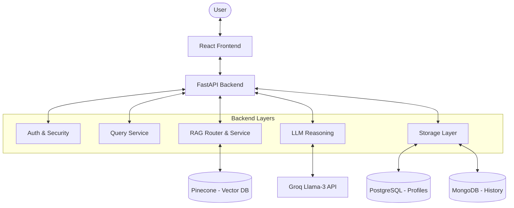
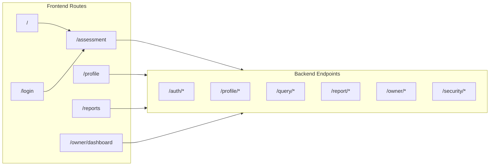
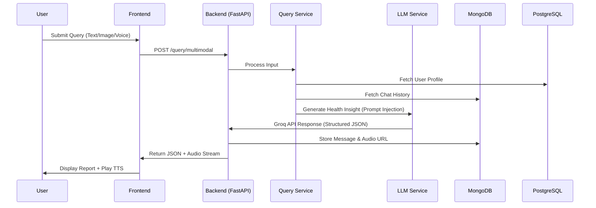

# AI Health Assistant - System Architecture

## Overview
This document outlines the architectural design of the AI Health Assistant, a "Google-Level" engineering project designed to provide preliminary health insights using multimodal inputs (text, voice, image) and Large Language Models (LLM).

**CRITICAL SAFETY NOTE:** This system is **NOT** a medical diagnosis tool. It is an intelligent health companion that provides information, lifestyle advice, and potential risk factors based on user inputs. All outputs include uncertainty modeling and explicit disclaimers.

---

## 1. System Diagrams

### 1.1 High-Level Architecture


### 1.2 Routing Graph



### 1.3 Query Processing Flow



## 2. System Boundaries & Layered Architecture

The system is refactored into distinct layers to ensure separation of concerns, maintainability, and safety.

### 2.1 Input Layer (Frontend + API)
- **Responsibility:** Captures user intent via Text, Voice (Web Speech API), and Image (Upload).
- **Components:**
  - React Frontend (`InputArea.jsx`, `Chat.jsx`)
  - FastAPI Endpoints (`query_service.py`)
- **Normalization:** Voice is transcribed to text; Images are captioned (using BLIP model or LLM vision) to create a unified text-based context.

### 2.2 Profile Layer
- **Responsibility:** Manages static user data (Age, BMI, Chronic Conditions).
- **Components:**
  - PostgreSQL Database (`Profile` table)
  - `profile_router.py`
- **Data Contract:** Provides `ProfileDict` to the Reasoning Layer.

### 2.3 History Layer
- **Responsibility:** Maintains conversation context and detects long-term patterns.
- **Components:**
  - MongoDB (`Health_Memory` collection)
  - `mongo_memory.py`
- **Advanced Logic:** 
  - Retrieves last N messages.
  - Future state: Summarization and vector search (RAG) for long-term recall.

### 2.4 Reasoning Layer (The Brain)
- **Responsibility:** Synthesizes inputs, profile, history, and retrieved medical knowledge to generate insights.
- **Components:**
  - `llm_service.py` (Groq/Llama-3 integration)
  - `rag_router.py` (Intent-based routing)
  - `rag_service.py` (Pinecone vector search)
- **Key Features:**
  - **Intent-Based RAG:** Routes queries to specific datasets (MedlinePlus, WHO, ICD-11) based on user intent.
  - **Context Injection:** Merges Current Symptoms + Profile + History + RAG Medical Data.
  - **Structured Output:** Enforces a strict JSON schema with mandatory `health_information` for condition explanations.
  - **Escalation Logic:** Checks history for worsening trends before generating advice.

### 2.5 RAG Routing & Medical Knowledge
- **Responsibility:** Provides evidence-based medical information for clinical context.
- **Logic:**
  1. **Intent Detection:** Classifies queries (Disease, Symptom, Drug, Lab Report) with strict priority.
  2. **Query Augmentation:** Expands user queries with clinical keywords (e.g., "causes", "management").
  3. **Vector Retrieval:** Performs semantic search in Pinecone using `all-mpnet-base-v2` embeddings.
  4. **Source Priority:** Ranks results from trusted sources like MedlinePlus and WHO.
  5. **Symptom Shortcut:** Bypasses vector search for common symptoms (e.g., "fever", "nausea") using optimized fallback logic.

### 2.6 Safety Layer (Guardrails)
- **Responsibility:** Intercepts inputs and outputs to prevent harm.
- **Components:**
  - `guardrails.py` (Mock/Rule-based)
- **Rules:**
  - Block requests for "prescriptions" or "emergency" handling.
  - Force "EMERGENCY" severity if keywords (e.g., "chest pain", "suicide") are detected.
  - Append mandatory disclaimers to all outputs.

### 2.7 Output Layer
- **Responsibility:** Presents data to the user in a human-readable and explainable format.
- **Components:**
  - React UI (`ReportCard.jsx`)
  - PDF Generator (`report_router.py`)
- **Features:**
  - Visual Severity Badges.
  - "Why this advice?" (XAI Panel).
  - Condition Explanations (RAG-backed).
  - Downloadable PDF reports.

### 2.8 Measurement & Evaluation Layer
- **Responsibility:** Tracks system performance and user satisfaction to enable data-driven improvements.
- **Components:**
  - `feedback_router.py` (API for user ratings)
  - `mongo_memory.py` (Logging to `Health_Feedback` and `Health_Analytics`)
- **Signals:**
  - **User Feedback:** Thumbs Up/Down on reports.
  - **Safety Triggers:** Logs frequency of critical keyword detection.
  - **Escalation Accuracy:** Logs instances where AI sets severity to "HIGH" or "EMERGENCY" for offline review.

---

## 3. AI Confidence & Uncertainty Modeling

To adhere to Responsible AI principles, every response includes metadata about the AI's certainty.

### JSON Schema
```json
{
  "summary": "Brief health summary...",
  "health_information": "Detailed RAG-backed condition explanation...",
  "possible_causes": ["Cause A", "Cause B"],
  "risk_assessment": {
    "severity": "LOW" | "MEDIUM" | "HIGH" | "EMERGENCY",
    "confidence_score": 0.0 - 1.0,
    "uncertainty_reason": "Explanation if confidence < 0.8"
  },
  "explanation": {
    "reasoning": "Why the AI concluded this...",
    "history_factor": "Did history influence this?",
    "profile_factor": "Did age/BMI influence this?"
  },
  "recommendations": {
    "immediate_action": "See a doctor...",
    "lifestyle_advice": ["Sleep more", "Drink water"],
    "food_advice": ["Eat leafy greens", "Avoid sugar"]
  },
  "disclaimer": "Standard medical disclaimer..."
}
```

---

## 4. Explainable AI (XAI)
We treat the LLM as a "Glass Box" where possible. The `explanation` and `health_information` fields in the response are exposed to the user via an "Analysis Panel" in the UI. This answers:
1. **Why this severity?** (e.g., "Symptoms have persisted for >3 days")
2. **What is this condition?** (Evidence-based data from RAG)
3. **Why this advice?** (e.g., "Based on your high BMI, we recommend...")

---

## 5. Trade-offs & Engineering Decisions

### 5.1 Why RAG + Vector DB (Pinecone)?
- **Decision:** Transitioned from LLM-only to a hybrid RAG architecture using Pinecone and MedlinePlus/WHO datasets.
- **Reasoning:** While Llama-3 has a large context window, medical knowledge requires "ground truth" citations. RAG reduces hallucinations by providing the LLM with relevant, verified medical snippets from trusted sources before generation.

### 5.2 Why MongoDB for History?
- **Decision:** Store full conversation trees in NoSQL.
- **Reasoning:** Chat data is unstructured and polymorphic. MongoDB allows flexible schema evolution as we add new metadata (e.g., user feedback ratings) to messages without migrations.

### 5.3 Why React + FastAPI?
- **Decision:** Decoupled Frontend/Backend.
- **Reasoning:** Allows independent scaling. FastAPI provides automatic OpenAPI documentation and high-performance async handling for LLM streams. React allows for a rich, interactive "app-like" experience.

### 5.4 Why Safety Overrides AI?
- **Decision:** Hard-coded keyword detection (Rule-based) runs *before* and *after* the LLM.
- **Reasoning:** LLMs are probabilistic and can be jailbroken. Regular expressions for "suicide" or "heart attack" are deterministic and fail-safe.

---

## 6. Future Roadmap
- **Evaluation Pipeline:** Automated testing using "Golden Datasets" to measure hallucination rates.
- **RAG Integration:** Connect to a curated medical wiki for citation-backed answers.
- **Wearable Integration:** Ingest Apple Health / Google Fit data for real-time vitals.
