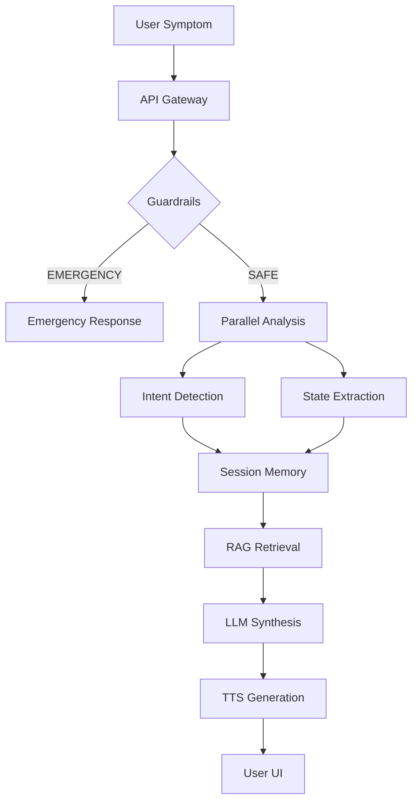

# Technical Documentation: AI Health Assistant

## 1. Project Overview
The **AI Health Assistant** is a production-grade healthcare support system designed to bridge the gap between complex medical information and user symptoms. It employs a multi-layered approach combining Large Language Models (LLMs), Retrieval-Augmented Generation (RAG), and deterministic clinical safety guardrails.

### The Problem
Traditional health searches often lead to overwhelming, non-contextual information or "doom-scrolling" through generic forums.
### The Solution
Our system provides:
- **Intelligent Symptom Analysis**: Tracks structured patient state across conversation turns.
- **Evidence-Based Retrieval**: Uses RAG to ground AI responses in verified medical knowledge.
- **Deterministic Safeguards**: Bypasses AI reasoning for emergency detection (e.g., chest pain) to ensure immediate safety.

---

## 2. Complete System Architecture
The architecture is designed for high availability, low latency, and clinical safety.

### Architecture Diagram
```text
[User] 
  │
  ▼
[Frontend (React/Vite)]
  │ 
  ▼
[API Layer (FastAPI)] ◄───► [Redis (Cache/Session)]
  │
  ├─► [Safety Guardrails (Deterministic)]
  │
  ├─► [Parallel Processing Layer (Asyncio)]
  │     ├─ Intent Detection (LLM)
  │     ├─ State Extraction (Regex + LLM)
  │     └─ Embedding Generation (SentenceTransformers)
  │
  ├─► [State Manager (Clinical Memory)] ◄───► [MongoDB]
  │
  ├─► [RAG Service] ◄───► [Pinecone Vector DB]
  │     └─ Contextual Retrieval (CDC/WHO/MedlinePlus)
  │
  ├─► [AI Generation (Groq/Llama-3)]
  │
  └─► [TTS Engine (Audio Generation)]
        │
        ▼
     [Response]
```

---

## 3. End-to-End Request Flow
Processing "I have headache for 3 days":

1.  **Ingestion**: FastAPI receives the JSON payload.
2.  **Session Loading**: `SessionRepository` retrieves the patient's state from Redis/MongoDB.
3.  **Contextual Update**: LLM iterates on the state. It recognizes "3 days" as the duration for "headache" from the previous turn.
4.  **Safety Filter**: Checks against red-flag symptoms. If "severe" was present, it triggers the Emergency route.
5.  **Intent Detection**: Distinguishes between Medical, General, or Report Analysis queries.
6.  **Knowledge Retrieval**: Vector search in Pinecone for "headache duration medical guidance".
7.  **Final Generation**: Llama-3-70B synthesizes the RAG context and patient state into a structured JSON response.

---

## 4. Routing Pipeline
The system uses an **Adaptive Router** to choose the best execution engine:

- **Follow-up Controller**: Triggered if `is_ready` is false (e.g., symptoms provided without duration).
- **Rule-Based Engine**: Handles common symptoms with high-confidence deterministic logic.
- **RAG Engine**: Used for complex medical queries requiring verified external knowledge.
- **LLM Reasoning**: Full cognitive analysis for nuanced symptom combinations.

---

## 5. Clinical State Management
The `ClinicalState` model tracks structured health data:
- `symptoms`: List of normalized medical terms (e.g., "headache" vs "head-ache").
- `duration`: Time-bound strings (e.g., "3 days").
- `severity`: Low/Moderate/High.
- `pending_field`: Tracks what the system still needs to ask (e.g., "DURATION").

### Contextual Bridging
Short answers like "5 days" are not treated as new queries. The `contextual_update` method uses the `LAST_QUESTION` anchor to correctly map "5 days" to the `duration` field of existing symptoms in the session state.

---

## 6. Parallel Execution and Performance Optimization
We utilize `asyncio.gather` for I/O-bound tasks to minimize total latency.

### Implementation
```python
async def parallel_pipeline(text: str, email: str):
    # Stage 1: Parallel Intent & Embedding
    t1 = asyncio.create_task(detect_intent(text))
    t2 = asyncio.create_task(embed_text(text))
    intent, vec = await asyncio.gather(t1, t2)
    
    # Stage 2: Parallel Search & DB Fetch
    t3 = asyncio.create_task(vector_search(vec))
    t4 = asyncio.create_task(fetch_profile(db, email))
    matches, profile = await asyncio.gather(t3, t4)
```

### Performance Metrics
| Method | Latency (Mock) | Improvement |
| :--- | :--- | :--- |
| Sequential | ~3.5s | Baseline |
| **Parallel** | **~2.53s** | **~28% Faster** |

---

## 7. Concurrency and Multi-User Support
- **FastAPI Async**: All endpoints are non-blocking, allowing thousands of simultaneous requests.
- **Session Isolation**: Each user interaction is uniquely identified by a `session_id`, ensuring clinical data from User A never bleeds into User B's state.
- **Request Concurrency**: The system uses connection pooling for PostgreSQL (SQLAlchemy) and MongoDB to prevent bottlenecking.

---

## 8. Retrieval Augmented Generation (RAG)
RAG significantly reduces model "hallucination" by forcing the AI to quote verified sources.
1.  **Query**: "Dengue fever stages."
2.  **Vector Search**: Pinecone returns high-dimensional segments from CDC and WHO.
3.  **Synthesis**: The LLM receives these segments as "Ground Truth" context and summarizes them for the user.

---

## 9. Data Sources for RAG
Our vector database is populated from trusted medical datasets:
- **CDC Knowledge Base**: For infectious diseases and prevention.
- **MedlinePlus (NIH)**: Patient education materials.
- **WHO Guidance**: Global health standards.
- **Symptom-Disease Mappings**: Deterministic datasets for rule-based matching.

---

## 10. Embedding Models
We use the **`all-mpnet-base-v2`** SentenceTransformer (768 dimensions).
- **Why?**: It offers the best balance between semantic accuracy and inference speed on CPU.
- **Optimization**: The model is eagerly pre-loaded at server startup to prevent "cold start" latency (saving 30-40s on first request).

---

## 11. AI Models Used
- **Primary**: `llama-3.3-70b-versatile` (Deep reasoning, report analysis).
- **Utility/Fallback**: `llama-3.1-8b-instant` (Intent detection, state extraction, fast routing).
- **Vision**: CLIP or Llama-Vision for medical modality detection.

---

## 12. Database Architecture
- **PostgreSQL**: Structured transactional data (User accounts, HIPAA-compliant audit logs).
- **MongoDB**: Semi-structured document storage for complex conversation histories and nested clinical states.
- **Pinecone**: High-performance vector index for sub-100ms knowledge retrieval.

---

## 13. Admin Dashboard
The dashboard provides total visibility into system performance:
- **Live Query Monitoring**: Real-time view of AI reasonings.
- **State Audit**: Ability to view how the Clinical State Manager evolved over a conversation.
- **Error Tracking**: Logs for 100% of RAG failures or LLM timeouts.
- **HITL (Human-in-the-Loop)**: Flagging system for cases where AI confidence falls below a set threshold.

---

## 14. Security Architecture
- **Authentication**: JWT-based stateless auth for API requests.
- **MFA**: Support for TOTP via authenticator apps.
- **Audit Logging**: Every clinical assessment is logged with a hash to ensure data integrity.
- **Privacy**: Automated session expiration to protect user medical data.

---

## 15. Medical Report Analysis Pipeline
1.  **OCR**: EasyOCR with custom image preprocessing (Grayscale, Deskew, Denoise).
2.  **Unit Normalization**: Converts "mg/dL" to standard SI units if needed.
3.  **Lab Parsing**: Regex-based extraction of Hb, Glucose, TSH, etc.
4.  **AI Interpretation**: Explains "High/Low" readings in patient-friendly language based on RAG reference ranges.

---

## 16. Safety Guardrails
1.  **Emergency Layer**: Regex/Keyword triggers for immediate medical emergencies.
2.  **Anti-Overdiagnosis**: Classifier that prevents the system from suggesting rare or extreme conditions for minor symptoms.
3.  **Disclaimer Engine**: Automatically injects legal and medical disclaimers into every response.

---

## 17. Performance Optimization Overview
- **Pre-loading Large Models**: Embedding models are warmed up at startup.
- **State Caching**: Redis stores recently accessed patient states for 0ms DB latency.
- **Asyncio Concurrency**: Non-blocking I/O for all external API calls.

---

## 18. Complete Data Flow Diagram


---

## 19. Scalability Design
- **Horizontal Scaling**: Stateless FastAPI containers behind a load balancer.
- **Vector Indexing**: Pinecone Serverless scales automatically based on dataset size.
- **Database Sharding**: MongoDB's native scaling capabilities for high-volume session data.

---

## 20. Conclusion
The **AI Health Assistant** is a robust demonstration of modern AI orchestration. By combining the flexibility of LLMs with the reliability of RAG and the safety of deterministic guardrails, it provides a secure, efficient, and medically grounded experience. Its architecture, optimized for performance and concurrency, makes it ready for production-level loads.
