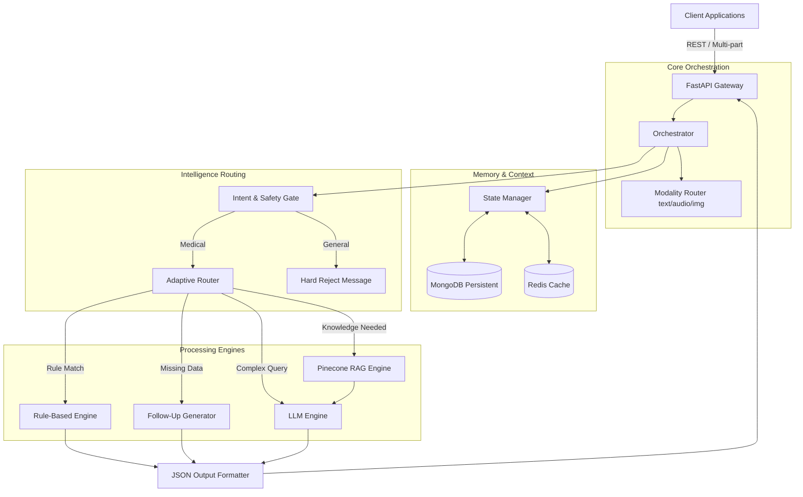
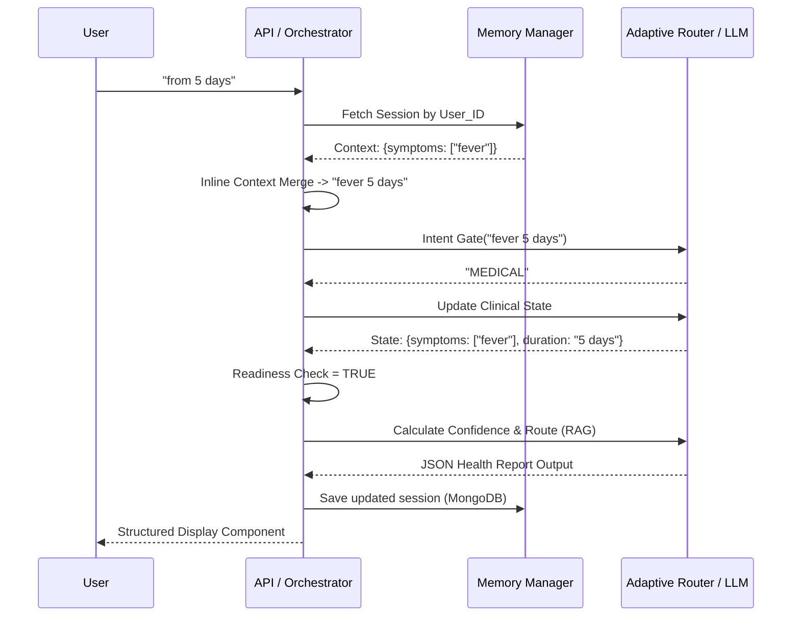
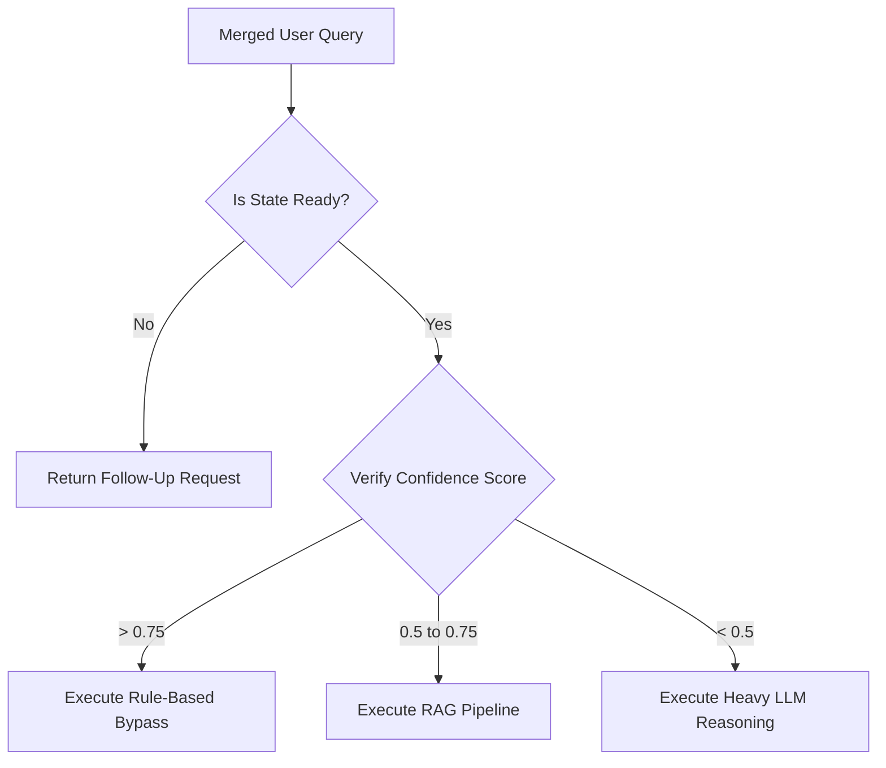

# AI Health Assistant: Technical Architecture & System Overview

> **A Complete Guide for Technical Interviews and System Review**

---

## 1. Project Overview

The **AI Health Assistant** is a multimodal, deterministic, state-driven healthcare triage and information system. 

*   **What problem it solves:** General-purpose LLMs hallucinate medical facts and suffer from "context amnesia." They fail multi-turn clinical interviews because they forget previous symptoms when asking for follow-up details (like duration).
*   **Why this system is needed:** To provide an aggressively safeguarded conversational interface that filters out non-medical noise, persistently structures user health states, retrieves verified medical evidence, and safely suggests next steps without making definitive diagnoses.
*   **Key Capabilities:**
    *   Strict Medical Intent Gating.
    *   Stateful Multi-turn Clinical Memory.
    *   Multimodal Processing (Text, Voice, Medical Reports, Images).
    *   Adaptive Model Routing (Deterministic Rules vs. RAG vs. LLM).

---

## 2. High-Level Architecture

The system utilizes a modular, layer-driven architecture to enforce separation of concerns:

*   **API Layer (FastAPI):** Exposes high-performance asynchronous REST endpoints. Handles multi-part forms, file uploads, and streaming.
*   **Orchestration Layer:** Acts as the central nervous system. It orchestrates intent detection, invokes memory retrieval, triggers modality-specific pipelines, and formulates final responses.
*   **Memory Layer (MongoDB):** Provides persistent storage for conversation history and structured clinical states (`ClinicalState`).
*   **Cache Layer (Redis):** Ensures incredibly fast retrieval of active session contexts and heavily requested verified medical responses.
*   **Embedding + Retrieval Layer (Pinecone / Vector DB):** Powers the RAG pipeline. It fetches semantically related, verified medical literature to ground the LLM's responses.
*   **LLM Layer:** Utilizes a Dual-Model setup. 
    *   *Primary:* Heavy model (`llama-3.3-70b-versatile`) for complex synthesis.
    *   *Fallback/Gate:* Fast model (`llama-3.1-8b-instant`) for cheap, sub-second intent detection.
*   **Rule-Based Engine:** Implements deterministic safety guardrails, missing-information checkers, and hardcoded symptom shortcuts—bypassing the LLM entirely when strict logic applies.

### High-Level Architecture Diagram



---

## 3. End-to-End Request Flow

The pipeline executes through strict, sequential steps to guarantee medical safety.

1.  **User Input:** The user submits a query (e.g., "5 days").
2.  **Session-Aware Context Merge:** The system checks if the active session is waiting for a follow-up answer. It seamlessly merges short naked inputs ("5 days") with the stored state ("fever") → `"fever 5 days"`.
3.  **Intent Detection (Strict Mode):** A fast LLM call classifies the merged intent. If `GENERAL`, the query is hard-rejected. If `MEDICAL`, it proceeds.
4.  **Load Memory & Contextual State Update:** The system loads the persistent `ClinicalState` from MongoDB. The Controller analyzes the merged string to update the state.
5.  **Readiness Check:** The Rule Engine evaluates if the `ClinicalState` has the minimum required fields (Symptoms AND Duration).
6.  **Clinical Validation & Confidence Scoring:** Evaluates the clinical relevance of the combined state and assigns an AI Precision/Confidence score.
7.  **Adaptive Routing:**
    *   **follow_up:** Routes to Follow-Up Generator if data is missing.
    *   **rule_based:** High-confidence direct matches bypass generative text.
    *   **rag:** Medium-confidence states pull verified pinecone literature.
    *   **llm:** Fallback to LLM reasoning for complex/low-confidence edge cases.
8.  **Response Generation:** The chosen engine builds the response.
9.  **Cache & Output:** The response is cached in Redis, structured into strictly validated JSON, and returned.

### Request Flow Sequence Diagram



---

## 4. Stateful Memory System

The memory system is explicitly designed to eliminate context drop-off during multi-turn interviews.

*   **Structure:**
    ```json
    {
      "symptoms": ["headache", "fever"],
      "duration": "5 days",
      "severity": null,
      "confirmations": []
    }
    ```
*   **Persistence:** Sessions are keyed by `user_id` and saved atomically in MongoDB.
*   **Handling Short Answers:** When a user types a naked data point (e.g., `"2 days"`), the *Session-Aware Inline Context Merge* intercepts it prior to intent detection. It looks at the stored state (`symptoms: ["fever"]`) and forcefully prepends it so the downstream pipeline only sees the syntactically complete intent: `"fever 2 days"`.
*   **Role of `last_question`:** The session tracks exactly what the system just asked the user (e.g., "How long?"). This allows the controller to know if the user is natively starting a new topic or directly answering a system prompt.
*   **MongoDB Schema:** Stores `user_id`, `session_id`, the active structured `ClinicalState`, and an array of timestamp-ordered `history` message dictionaries.

---

## 5. Adaptive Routing Logic

To optimize for Speed, Cost, and Accuracy, queries are deterministically routed based on strictly calculated thresholds.

*   **IF not ready** → **Follow-Up Generator:** Bypass LLM generation entirely. Emit hard-coded/lightweight questions requesting `duration` or `symptoms`.
*   **IF confidence > 0.75** → **Rule-Based Engine:** Return pre-vetted, hardcoded JSON structures instantly (latency <200ms).
*   **IF confidence 0.5 – 0.75** → **RAG Engine:** Require grounding. Fetch specific articles from Vector DB and enforce LLM constraint.
*   **IF confidence < 0.5** → **LLM Engine:** Utilize the heaviest model (`llama-3.3-70b-versatile`) to perform complex reasoning on ambiguous states.

### Routing Flow Diagram



---

## 6. Parallel Processing & Latency Optimization

LLM queries and database lookups are expensive bottlenecks. The architecture mitigates this using multi-tiered optimizations:

*   **Parallel Execution:** Intent detection (cheap LLM call) and Embedding generation (for RAG) are fired in parallel using `asyncio.gather()`. 
*   **Async I/O:** All MongoDB / Pinecone database operations and external API hits utilize `async/await`, absolutely strictly unblocking the single-threaded Python event loop.
*   **Redis Caching Strategies:**
    *   *Embeddings:* Heavy embedding vectors are cached temporarily.
    *   *Retrieval:* Identical queries map to cached Pinecone chunks.
    *   *Responses:* Common symptom responses bypass computation entirely.
*   **Cold vs. Warm Starts:** Serverless/container spin-ups (cold starts) incur DB connection overhead. To counter this, Redis connection pools and DB clients are instantiated at the global App scope (`lifespan` events in FastAPI) keeping them eternally "warm".

---

## 7. Response Generation Strategy

*   **Strict JSON Formatting:** The system completely disables free-text raw chat. The LLM is programmatically forced to output strict JSON schemas (using native JSON format enforcement via the API). 
*   **Schema Enforcement:** The LLM must define `health_information`, `possible_conditions`, and `recommended_next_steps`. This allows the React frontend to natively parse blocks without ugly text hacking.
*   **Symptom Synthesis:** The "Merge Safety Net" guarantees LLMs cannot hallucinate dropping symptoms. The orchestration code explicitly performs a mathematical `UNION` of `prev_state.symptoms` and the LLM's `updated_state.symptoms`. The code is the master record, the LLM is merely the enricher.

---

## 8. Failure Handling & Edge Cases

*   **Missing or Ambiguous Input:** Non-medical gibberish or small talk is trapped instantly by the *Intent Gate*. The gate outputs a static, hardcoded template: *"I am an AI Health Assistant... Please describe your health concern."* This totally prevents payload injection or hallucination jailbreaks.
*   **Loop Prevention:** If the system asks for duration and the user replies with nonsense consecutive times, the `Clinical Validator` detects continuous loop states, aborts the follow-up request, and forces a generic fallback response based only on the symptoms acquired.
*   **Spurious Entity Extraction:** Regex validators (`_is_valid_duration`) ensure phrases like "getting" or "having" are computationally rejected as durations when the LLM accidentally extracts them.

---

## 9. Scalability & Production Considerations

*   **Horizontal Scaling:** Since conversation state is persisted directly in MongoDB (and cached via Redis), the FastAPI instance pods are 100% stateless. Kubernetes HPAs (Horizontal Pod Autoscalers) can instantly clone pods based on CPU/traffic spikes without losing user context.
*   **Database Indexing:** MongoDB uses combined compound indexes on `user_id` and `timestamp` descending. This means fetching the `User Memory History` (required on every single execution) takes sub-millisecond time.
*   **Rate Limiting & Monitoring:** JWT tokens uniquely bind requests to users, enabling strict IP/User based rate-limiting. All events (intent triggers, modality choices, rule fallbacks) fire asynchronous audit logs for ingestion into Datadog/NewRelic.

---

## 10. Interview Explanation Section

> *"Can you walk me through exactly what happens when a user types a follow-up answer into the system?"*

**The "Script" (Memorize This):**

"First, the user input arrives at the **FastAPI orchestration layer**. Before we even send it to an LLM, we check their active **Stateful Memory** in MongoDB. 

If this user previously said 'I have a fever', they are in a pending session state waiting for duration. So when they type just '5 days', our **Session-Aware Context Merge** intercepts that text. It combines their active state and the new input to programmatically create the complete string: '*fever 5 days*'. 

Now, this complete string hits our **Medical Intent Gate**. It successfully passes as a medical query. Next, the **State Updater** marks our constraint checklist as complete: *Symptoms: Yes, Duration: Yes*. 

Because we are now flagged as 'Ready', the pipeline triggers the **Adaptive Router**, which pulls evidence using RAG, dynamically builds a contextual prompt with the full clinical state, and uses our heaviest LLM to generate the final, strictly-formatted JSON health report. 

Because we manage the state structure in Python *outside* of the LLM, the AI never loses context or hallucinates past symptoms."

---

## 11. Tech Stack

*   **API Framework:** FastAPI, Uvicorn, Asyncio (Python 3.10+)
*   **State & Persistence:** MongoDB, SQLAlchemy (Postgres for Auth)
*   **Caching & Fast Data:** Redis
*   **AI Models:** Groq API (`llama-3.3-70b-versatile` layer, `llama-3.1-8b-instant` layer)
*   **Vector Database (RAG):** Pinecone
*   **Frontend UI:** React, TailwindCSS, Lucide-React
