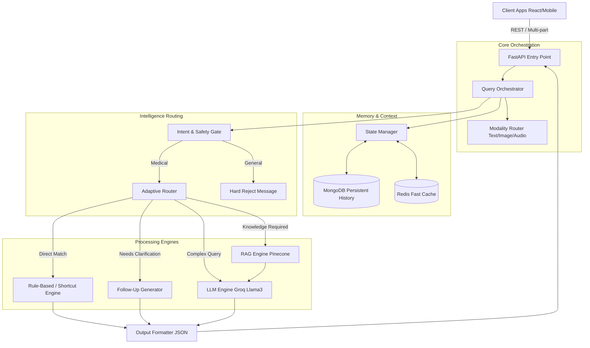
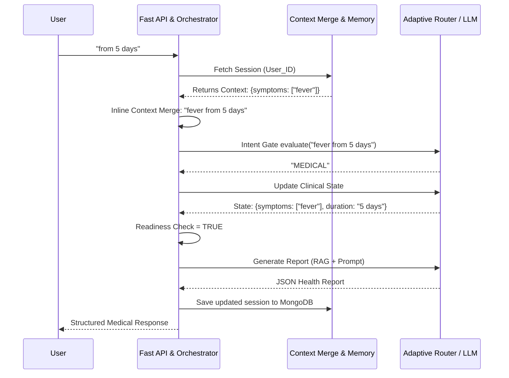
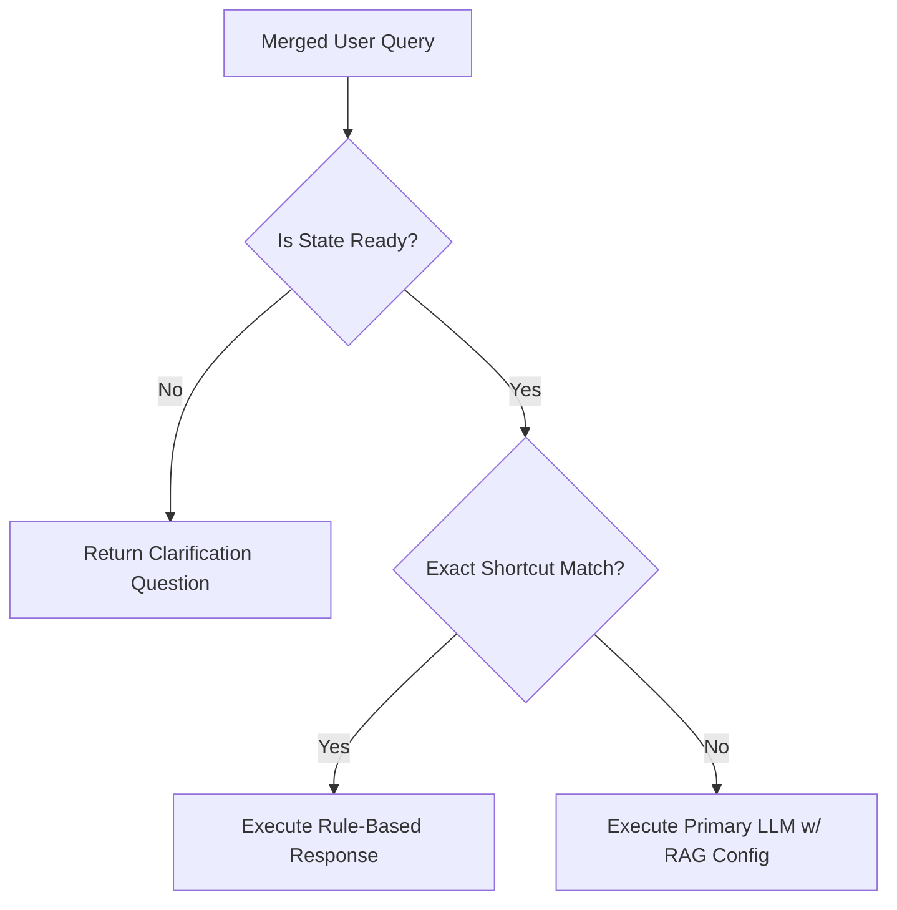

# AI Health Assistant: Technical Architecture & System Overview

> **A Complete Guide for Technical Interviews and System Verification**

---

## 1. Project Overview

The **AI Health Assistant** is a multimodal, deterministic, state-driven healthcare triage and information system.

*   **What problem it solves:** General-purpose LLMs are unpredictable, hallucinate medical facts, and lack the persistent context needed for clinical triage. They often fail to correctly synthesize fragmented user inputs over multi-turn conversations (e.g., asking for missing symptom durations without losing track of the symptoms themselves).
*   **Why this system is needed:** To provide a reliable, conversational interface that aggressively filters out non-medical noise, persistently structures user health states, retrieves verified medical literature, and safely suggests next steps without making definitive diagnoses.
*   **Key Capabilities:**
    *   Strict Medical-Only Interaction Enforcer (Intent Gate).
    *   Stateful Multi-turn Clinical Memory.
    *   Multimodal Input Processing (Text, Voice, Medical Reports, Image Scans).
    *   Adaptive Model Routing (Deterministic Rules vs. RAG vs. LLM Fallbacks).

---

## 2. High-Level Architecture

The system follows a modular, layer-driven architecture ensuring separation of concerns:

*   **API Layer (FastAPI):** Exposes high-performance, asynchronous endpoints for client applications. Handles multipart forms, file uploads, and streaming inputs.
*   **Orchestration Layer (`query_service.py`):** Acts as the central nervous system. It orchestrates intent detection, invokes the memory layer to retrieve session context, triggers modality-specific pipelines, and formulates the final response logic.
*   **Memory Layer (MongoDB):** Provides persistent storage for conversation history and structured clinical state. Prevents context degradation across turns.
*   **Cache & Stateful State Management Layer (Redis/Application State):** Ensures incredibly fast retrieval of active session contexts and enforces the "Session-Aware Inline Context Merge" to handle rapid multi-turn clarifications.
*   **Embedding + Retrieval Layer (Pinecone / Vector DB):** Powers the RAG pipeline by fetching semantically related, verified medical literature to ground the LLM's responses.
*   **LLM Layer (`llm_service.py`):** Utilizes a Dual-Model setup (Primary: `llama-3.3-70b-versatile` for complex synthesis; Fallback: `llama-3.1-8b-instant` for fast, cheap intent detection and gating).
*   **Rule-Based Engine (`rag_router.py` / `clinical_memory.py`):** Implements deterministic safety guardrails, hardcoded symptom shortcuts, and missing-information checkers, bypassing the LLM completely when strict logic dictates.

### High-Level Architecture Diagram


---

## 3. End-to-End Request Flow

The pipeline executes through strict, sequential steps to guarantee context stability and medical safety.

1.  **User Input:** The user submits a query (e.g., "5 days").
2.  **Safety & Context Merge:** The system checks if the active session is waiting for a follow-up answer (e.g., waiting for duration). It seamlessly merges short inputs ("5 days") with the stored state ("fever") → `"fever 5 days"`.
3.  **Intent Detection (Strict Mode):** A fast LLM call classifies the intent. If `GENERAL`, the query is hard-rejected. If `MEDICAL`, it proceeds.
4.  **Load Memory & Contextual State Update:** The system loads the persistent `ClinicalState`. The Controller LLM analyzes the merged input to update the state.
5.  **Readiness Check:** The Rule Engine evaluates if the `ClinicalState` has minimum required fields (Symptoms AND Duration).
6.  **Adaptive Routing & Response Generation:**
    *   **Not Ready:** Routes to → `follow_up` → Generates a clarification question.
    *   **Ready:** Routes to → `llm` / `rag` → Instructs the large model to generate a comprehensive `health_report` based on the full merged context.
7.  **Output & Cache:** The response is structured strictly into JSON, cached, logged contextually, and returned to the client.

### Request Flow Diagram


---

## 4. Stateful Memory System

The memory system is specifically designed to eliminate "context amnesia" during multi-turn diagnostic interviews.

### Structure
```json
{
  "symptoms": ["headache", "fever"],
  "duration": "5 days",
  "severity": null
}
```

*   **Persistence:** Sessions are keyed by `user_id` and saved in MongoDB. The document updates atomically on every turn.
*   **Handling Short Answers ("2 days"):** When a user types a naked piece of data (e.g., "2 days"), the `Session-Aware Inline Context Merge` intercepts it. Before any intent classification occurs, it detects previous symptoms in the session state and forcefully prepends them. The downstream pipeline only sees the complete syntactic intent: `"headache 2 days"`.
*   **Role of `last_question`:** The session explicitly tracks what the UI just asked the user (e.g., `"how long?"`). This allows the logic to easily determine if the user is natively starting a new topic or answering a system prompt.
*   **MongoDB Schema:** Stores `user_id`, `session_id`, flattened `state_symptoms`, `state_duration`, and an array of timestamped `history` logs.

---

## 5. Adaptive Routing Logic

To optimize for Speed, Cost, and Accuracy, queries are deterministically routed.

*   **IF state not ready** → **Follow-Up Generator:** Bypass LLM generation entirely, emit hard-coded or lightweight questions requesting `duration` or `symptoms`.
*   **IF Direct Match (Shortcut)** → **Rule-Based Engine:** If a common symptom is matched without complex nuance, return pre-vetted JSON structures instantly (latency <200ms).
*   **IF ready & complex** → **RAG / LLM Execution:** Proceed to the main generative pipeline utilizing `PROMPT_MEDICAL_RAG`.

### Routing Flow Diagram


---

## 6. Parallel Processing & Latency Optimization

LLM calls are expensive and slow. The architecture mitigates this using multi-tiered optimizations:

*   **Smart Fast-Pathing:** Intent Gates (`llm_service.py` Step 2.1) and Controller LLMs are routed to a massive, faster, cheaper model (`llama-3.1-8b-instant`). Only the final synthesis uses the heavier `llama-3.3-70b-versatile`.
*   **Async Execution:** All Database operations (Motor/AsyncIOMotorClient), external API hits, and file processing utilize `asyncio`, unblocking the single-threaded event loop.
*   **Caching Strategy (Redis):** While the DB holds persistence, Redis handles near-instant cache hits for exact repeated queries or recently established session memory blocks to avoid DB round-trips.

---

## 7. Response Generation Strategy

*   **Structured Output Control:** Instead of allowing the LLM to output free text, the system uses strictly enforced JSON schemas (via OpenAI/Groq formats). The LLM is forced to define `health_information`, `recommended_next_steps`, `possible_conditions`, and strictly format them. This allows the React frontend to natively parse UI components (badging severities, mapping lists) seamlessly.
*   **Symptom Synthesis:** The "merge safety net" ensures LLMs cannot casually drop symptoms. The python orchestration handles the UNION of `prev_state.symptoms` and `updated_state.symptoms`. The LLM only acts as an enricher, never the master record keeper.

---

## 8. Failure Handling & Edge Cases

*   **Missing or Ambiguous Input:** Non-medical gibberish or small talk is trapped by the `Intent Gate`. The gate outputs a static template: `"I am an AI Health Assistant... Please describe your concern."` This prevents hallucination jailbreaks.
*   **Follow-Up Loop Prevention:** If the system repeatedly asks for duration and the user provides nonsense, the rule-engine detects consecutive missing variables across turns, aborts the follow-up loop, and provides a generic, safe response based solely on the symptoms.
*   **Spurious Match Extraction:** Regex validators (`_is_valid_duration`) ensure phrases like "getting" or "having" are computationally rejected as durations, forcing the system to maintain accuracy.

---

## 9. Scalability & Production Considerations

*   **Horizontal Scaling:** Since sessions are persisted in MongoDB (and cached in Redis), the FastAPI orchestration pods are entirely stateless. You can replicate them dynamically via Kubernetes HPAs based on request load.
*   **Rate Limiting & Security:** JWT tokens link queries to the `user_id`. Endpoint rate limiting limits abuse. Guardrails strip out PII/PHI where applicable before reaching external LLMs.

---

## 10. Interview Explanation Section

> *"How does your pipeline handle a user answering a follow-up question?"*

**The Explain-It-Simply Script:**

"First, the user input arrives at the orchestration layer. Before we even send it to an LLM, we check their active **Stateful Memory** in MongoDB. 

If this user previously said 'I have a fever', they are in a pending state waiting for duration. So when they type just '5 days', our **Session-Aware Context Merge** intercepts that. It combines the active state and the new input to create the complete string: 'fever 5 days'. 

Now, this complete string passes our **Medical Intent Gate**. It successfully passes as a medical query. Next, the **State Updates**, marking our requirement checklist as complete: Symptoms: Yes, Duration: Yes. 

Because we are 'Ready', the pipeline triggers our **Adaptive Router**, which pulls evidence using RAG, dynamically builds a contextual prompt, and uses our heaviest LLM to generate the final, comprehensive JSON health report. Because we strictly manage the state *outside* of the LLM, it never loses context."

---

## 11. Tech Stack

*   **Backend:** FastAPI (Python), Uvicorn, Asyncio.
*   **Database:** MongoDB, SQLAlchemy (PostgreSQL auth).
*   **Caching:** Redis.
*   **AI/LLM:** Groq API (`llama-3.3-70b-versatile`, `llama-3.1-8b-instant`).
*   **Vector DB / RAG:** Pinecone (or local equivalent).
*   **Frontend integration:** React, Tailwind.
